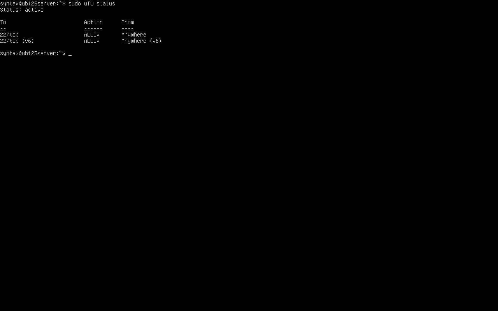

# Linux-server-hardening
# Linux Server Hardening (Ubuntu 26.04 LTS)

Scripts I use to secure Ubuntu Servers in production - Built for real-world sysadmin work.

## Tools Used
- UFW - Firewall (Uncomplicated Firewall)
- Lynis - Security Auditing 
- Fail2Ban - Blocks Brute-force attacks

## What this does
- Secures SSH (disables root login, changes port)
- Enables UFW firewall with default deny
- Installs Fail2Ban
- Runs Lynis audit

## Usage
chmod +x hardening.sh
sudo ./hardening.sh

## Why UFW?
UFW is a frontend for iptables. It simplifies firewall management on Ubuntu/Debian while using iptables in the background. Faster and safer for production.

## Proof of Hardening

Server: Ubuntu 25.10 on Oracle Virtualbox
UFW Status: active, SSh secured

Built by Kadir Seidu | Aspiring Linux SysAdmin - Ghana

